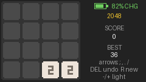

# Cardputer2048

给 M5Stack Cardputer ADV 写的 2048。Arduino 写的，源码和现成固件都在这个仓库里。



*这张是拿同一套绘制算法在电脑上跑出来的动画预览，不是真机拍的，字体和板子上略有差别。*

棋盘在左边，右边那条竖着排了电量、当前分数、最高分，最下面是按键提示和状态。

固件在 [Releases](https://github.com/ruanmei114514/Cardputer2048/releases/latest) 里，下载那个 `Cardputer2048-cardputer-adv.bin` 就能刷（怎么刷看下面）。

## 怎么玩

方向键推方块，两个一样的撞一起就合并，凑到 2048 算赢；格子占满又没有能合的，就结束。

## 按键

| 键 | 作用 |
| --- | --- |
| `;` `,` `.` `/` | 上、左、下、右。就是键盘右下角印着箭头的那四个键，**直接按，不用 Fn** |
| `DEL`（退格） | 撤销上一步。只留一步，按一下退回刚才，再按就没反应了 |
| `-` / `+` | 调屏幕亮度，一次 ±25。`=` 也能当加亮，省得按 Shift |
| `R` / 回车 | 重开一局 |

## 刷进机器

固件是整包镜像（bootloader + 分区表 + 程序）。从 [Releases](https://github.com/ruanmei114514/Cardputer2048/releases/latest) 下 `Cardputer2048-cardputer-adv.bin`，仓库根目录里也放了一份一样的，不想走 Release 直接从仓库拿也行。拿到之后从 0x0 刷：

```bash
esptool --chip esp32s3 --port /dev/ttyACM0 --baud 1500000 write_flash 0x0 Cardputer2048-cardputer-adv.bin
```

也可以丢进 M5Burner 的「自定义固件」，起始地址填 0x0。刷完 esptool 会自动重启，没起来就拨一下机身电源开关。

## 自己编译

Arduino IDE 2 里装好 `M5Unified`、`M5GFX`、`M5Cardputer` 三个库，开发板选 **M5Stack → M5Cardputer**，打开 `src/Cardputer2048/Cardputer2048.ino` 上传就能用。

ADV 现在还没有单独的板子选项，不影响使用：程序启动后由 M5Unified 自动识别 ADV，识别不出来时我留了 `fallback_board` 兜底，屏幕和键盘都会按 ADV 的引脚走。

## 存档

最高分和当前局面存在 nvs 分区（20KB）里，不需要额外的库，也不动分区表。

- 开机时如果有一局没打完的存档，棋盘上会弹个框：`ENTER: continue` 接着玩，`R: new game` 重开。
- 已经死局的存档直接忽略，开新局——死局接着玩没意义。
- 每 5 秒写一次盘，而且只在棋盘真的变了的时候写。所以突然断电，最多丢最后几秒的操作。
- 最高分破纪录是立刻写的。

**刷整包固件会把存档冲掉。** 整包从 0x0 覆盖到 0x400000，nvs 在 0x9000 那一段会被写成 `0xFF`。想留着存档，就别刷整包，只刷 app：

```bash
esptool --chip esp32s3 --port /dev/ttyACM0 --baud 1500000 write_flash 0x10000 Cardputer2048.ino.bin
```

（`Cardputer2048.ino.bin` 得自己编译一次才会生成。）

## 电量那栏

右上角是电量百分比，判断为充电时会变绿，后面多一个 `CHG`。

有一点要说清楚：**CHG 是猜出来的，不是读硬件。** ADV 没把充电状态接到 MCU——板子电路图上充电芯片 TP4057 的 CHRG/STDBY 两个脚是悬空的，M5Unified 对 ADV 的 `isCharging()` 也只会返回 `charge_unknown`。所以这里改看电池电压的趋势：5 秒内跳 25mV 以上、或者 30 秒里净升 15mV 以上，就当在充电；反向跳变就当没充。

由此带来几个现象：

- 插上电以后最慢要等 30 秒才显示 CHG。
- 开机时电池如果已经充满（电压基本不动），可能一直不显示，拔插一次就好。
- 插上 USB 的瞬间，百分比会往上跳 10% 左右。这是正常的：电量按电池端电压线性换算（3300mV=0%，4150mV=100%，也就是 1% 只有 8.5mV），充电电流在电池内阻上把端电压抬高了 80~90mV，正好 10%，拔掉会掉回来。
- 板上没有库仑计，所以这个百分比是"当前端电压对应的电量"，不是精确的剩余容量。

## 目录结构

```
Cardputer2048/          ← 仓库根目录
├── Cardputer2048-cardputer-adv.bin                  整包固件，刷这个
├── docs/preview.gif                                 上面那张预览图
├── README.md
└── src/Cardputer2048/                               Arduino sketch
    ├── Cardputer2048.ino                            显示、键盘、存档、电量
    ├── game2048.h                                   2048 逻辑 + 棋盘几何/动画参数（纯 C++）
    └── test/
        ├── test_2048.cpp                            逻辑自检
        ├── preview_2048.cpp                         在电脑上跑动画、输出帧
        └── make_preview.py                          把帧拼成 GIF 和连拍图
```

`src/Cardputer2048/` 和根目录各放了一份 bin，是同一个文件，刷哪个都行（放在 sketch 目录是方便和源码一起带着走）。

另外根目录还有个 `Cardputer2048-cardputer-adv-DEBUG-press-G.bin`，和正式版只差一行：按 `G` 直接把局面判成结束。当时是为了不用真打到死局就能看 GAME OVER 界面长什么样，自己玩的话刷正式版就行。

## 不用上机也能看

```bash
cd src/Cardputer2048
g++ -std=c++11 -o /tmp/t2048 test/test_2048.cpp && /tmp/t2048          # 逻辑自检
g++ -std=c++11 -o /tmp/p2048 test/preview_2048.cpp && /tmp/p2048 /tmp/cp2048_preview
python3 test/make_preview.py /tmp/cp2048_preview                       # 出 preview.gif 和 move_strip.png
```

预览和固件共用 `game2048.h` 里的 `frameTiles()`——某一帧哪个方块画在哪，两边是同一份算法算出来的，只是一个画到屏幕、一个画成图片。

## 实现上顺手记两点

- 棋盘和右侧面板各画在一块内存画布上，一帧只往屏幕推一次。最开始是每帧直接往屏幕上画的，结果移动时能看见"先铺底色、再画空格、再画方块"的闪烁，换成画布就干净了。
- 方块动画、合并弹出、新方块放大这几件事，用的都是 `frameTiles()` 算出来的位置，所以预览里看到的和机器上是同一套动作。

## 没做的

- 没有音效。
- 撤销只留一步，没做多步历史。
- 亮度不记忆，重启回到默认值。
